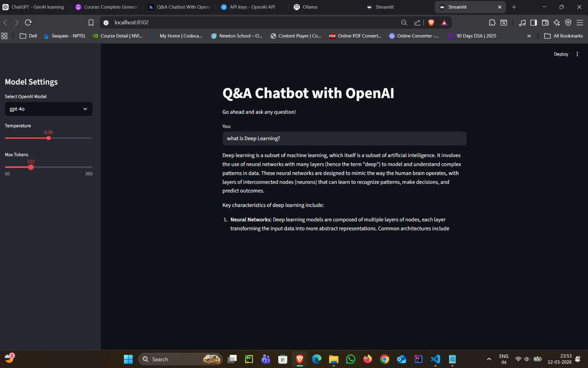

# 🤖 OpenAI LangChain Streamlit Chatbot

A simple **Q&A Chatbot** built using **OpenAI, LangChain, and Streamlit**.
The application allows users to ask questions and receive responses from OpenAI models such as **GPT-4o, GPT-4-Turbo, and GPT-3.5-Turbo** through an interactive Streamlit interface.

---

# 🚀 Features

* 🤖 Chatbot powered by **OpenAI GPT models**
* 🔗 Built with **LangChain**
* 🖥️ Interactive **Streamlit UI**
* ⚙️ Model selection from sidebar
* 🌡️ Adjustable **temperature**
* 📏 Adjustable **max tokens**
* 📊 **LangSmith tracing support**

---

# 🏗️ Tech Stack

* **Python**
* **LangChain**
* **OpenAI API**
* **Streamlit**
* **LangSmith**
* **Python Dotenv**

---

# 📂 Project Structure

```
openai-langchain-streamlit-chatbot/
│
├── app.py               # Main Streamlit chatbot application
├── requirements.txt    # Project dependencies
├── .env                # Environment variables
├── .gitignore          # Ignored files
└── README.md           # Project documentation
```

---

# ⚙️ Installation

## 1️⃣ Clone the Repository

```
git clone https://github.com/your-username/openai-langchain-streamlit-chatbot.git
cd openai-langchain-streamlit-chatbot
```

---

## 2️⃣ Create Virtual Environment

```
python -m venv venv
```

Activate it:

### Windows

```
venv\Scripts\activate
```

### Mac / Linux

```
source venv/bin/activate
```

---

## 3️⃣ Install Dependencies

```
pip install -r requirements.txt
```

---

# 🔑 Environment Variables

Create a `.env` file in the root directory and add the following variables:

OPENAI_API_KEY=your_openai_api_key


### Optional (for LangSmith tracing)
LANGCHAIN_API_KEY=your_langsmith_api_key
LANGCHAIN_PROJECT=OpenAI-Chatbot

---

# ▶️ Run the Application

```
streamlit run OpenAIchatbot.py
```

Then open:

```
http://localhost:8501
```

---

# 💬 How It Works

1️⃣ User enters a question in the Streamlit interface
2️⃣ LangChain builds a **prompt template**
3️⃣ OpenAI model generates a response
4️⃣ Output parser converts the response into plain text
5️⃣ Streamlit displays the answer

---

# 🧠 Architecture

```
User Input (Streamlit)
        ↓
Prompt Template (LangChain)
        ↓
OpenAI GPT Model
        ↓
Output Parser
        ↓
Streamlit Response
```

---

# 🖼️ Application Preview

Add a screenshot of the running app:




## 🧑‍💻 Author

**Shaik Zaid**

📧 [shaikzaid9393@gmail.com](mailto:shaikzaid9393@gmail.com)

💼 [LinkedIn Profile](https://www.linkedin.com/in/shaik-zaid-832407331/)

🐙 [GitHub](https://github.com/shaik-zaid)

---
# ⭐ Support

If you like this project:

⭐ Star the repository
🍴 Fork it

